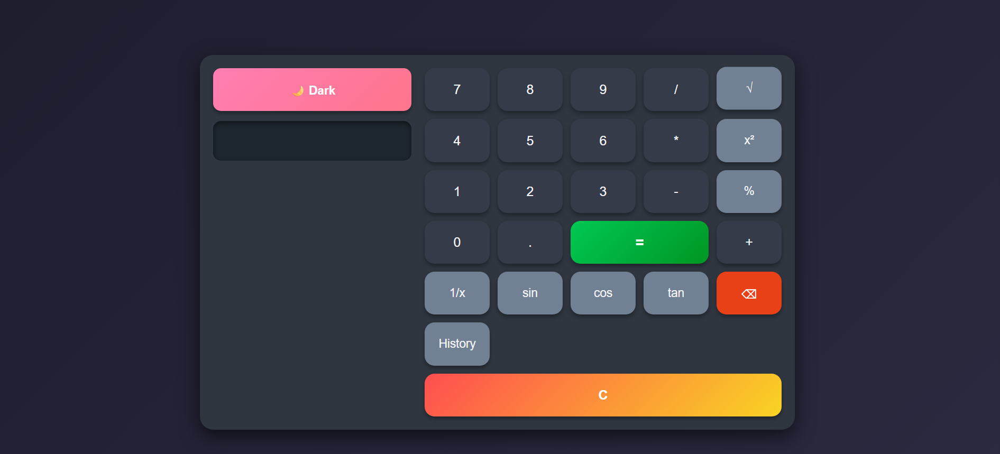

# Advanced Calculator

A simple yet powerful **Advanced Calculator** built using **HTML, CSS, and JavaScript**.  
It supports standard arithmetic operations along with some advanced features.

## 🚀 Features

- Basic operations: `+`, `-`, `×`, `÷`
- Advanced operations: `√`, `x²`, `%`
- Clear (`C`) and Delete (`DEL`) functions
- Responsive and modern UI
- Highlighted **equal (=) button** for better UX

## 🎮 How to Use

1. Clone or download the project.
2. Open `index.html` in your browser.
3. Start calculating!

## 🛠️ Technologies Used

- **HTML5** – Structure
- **CSS3** – Styling & Responsive UI
- **JavaScript (ES6)** – Functionality

## 📸 Preview

## 🚀 Live Demo
[Click here to try the calculator](https://your-username.github.io/advanced-calculator/)

## 📌 Future Improvements

- Add keyboard support
- Add history of calculations
- Add scientific functions (sin, cos, tan, log, etc.)

---

Made with ❤️ by Hamed
